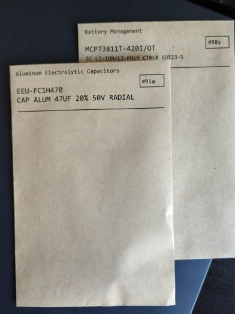

# Scripts for Partkeepr

These are python scripts for [Partkeepr](https://github.com/partkeepr/PartKeepr) written using the JSON API. This API is quite complex and not exactly a does not follow the standard REST standards, I found that it's best to use network tab in the developer tools of your browser and use copy to curl and this website (https://curl.trillworks.com/) to create python scripts. For all the scripts below, change login details and urls inside. Some python knowledge is probably required to get them running on your particular setup.

## Envelopes

Script to print labels on (coin) envelopes. Tip: in partkeepr, use descriptions as they are in DigiKey website, you'll have to manually look them up but they're quite short and look good on these envelopes. The ones from octopart import are a bit too long. Take for example CD4026BEE4

Digikey: IC COUNTER/DIVIDR DECADE 16-DIP

Octopart Import: CMOS Decade Counter/Divider with Decoded 7-Segment Display Outputs and Display Enable 16-PDIP -55 to 125

Using smaller coin envelopes 95mmx145mm result looks like this:

Requires: reportlab, pylabels

Optional: octopart categories from the script below, works without but requires modification

## Envelopes-LO

This is from my previous workflow used by [steve] as described on [hackaday](https://hackaday.com/2012/10/14/parts-storage-for-all-your-components/) It uses a conventional address spreadsheet and a writer template for printing on normal envelopes using the mail-merge feature in libreoffice. It's not connected to partkeepr but if you want to print on envelopes without partkeepr it might be worth a look. Requires: libreoffice.

## Export-XLSX

Export a lot of tables to an xlsx, note that there is already an export to csv and xls feature inside partkeepr, this was just the first script I wrote to check if I could work with the API, you might find it usefull for other things. If you're not into scripting, use the partkeepr tool. Requires: openpyxl.

## Import categories

This can be used when setting up partkeepr to initialize the category tree on the left. I'm using the categories from [octopart](https://octopart.com/electronic-parts). Nice thing about it is that you can use the end nodes (last part) in those categories to print on envelopes. Tip: if you're having a hard time installing partkeepr, use this [docker](https://github.com/mhubig/docker-partkeepr) image.

## Import parts

Adding parts can be quite a chore, especially if there is no previous database. If you're willing to invest the time it's best done by csv.  These scripts use a csv together with a small template json to upload.  Most shops/distributors do not offer csv of what you ordered before, to create such a file I found that the [web scraper](https://webscraper.io/) extension for chrome does the job well, make sure to follow along with the tutorials on their website. There are examples for banggood and mouser provided.

Requires: webscraper.io.